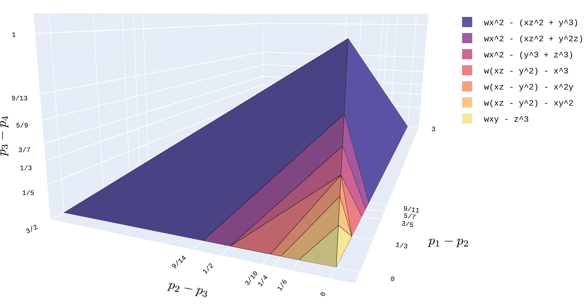
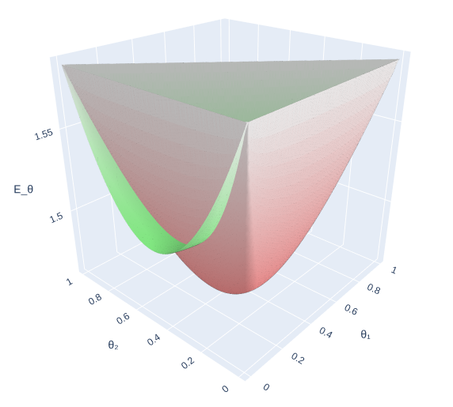
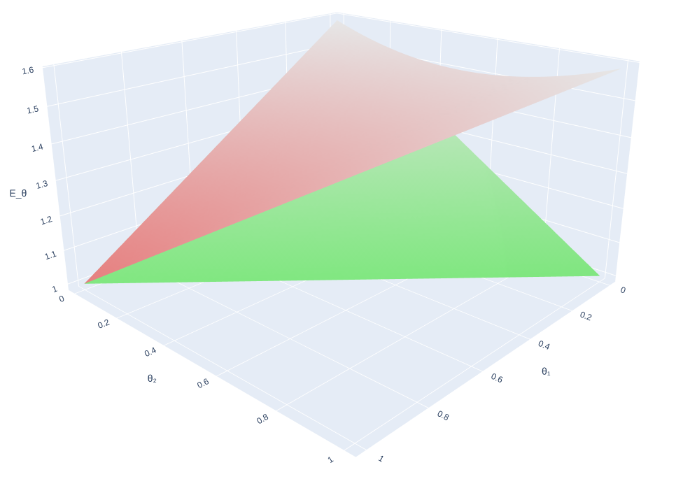

## Moment polytopes of tensors and cubics

The moment polytopes of the orbits closures of all tensors of shape 3x3x3, of some tensors in 4x4x4, and of many homogenous cubic forms (symmetric tensors of order three) of 3 and 4 variables.

See our paper [Computing moment polytopes — with a focus on tensors, entanglement and matrix multiplication](https://doi.org/10.48550/arXiv.2510.08336) for details.
These results were presented at STOC 2025. Extended abstract is available [here](https://doi.org/10.1145/3717823.3718221).

### Cubics — Visualization

Some visualizations are available as well. See [here](https://html-preview.github.io/?url=https://github.com/qi-rub/tensor_moment_polytopes/blob/main/visualizations/polytopes_sym3_c4.html) for the moment polytopes of some symmetric tensors of shape 4x4x4 under the symmetric GL(4) action (quaternary cubics), which are three dimensional. See [here](https://html-preview.github.io/?url=https://github.com/qi-rub/tensor_moment_polytopes/blob/main/visualizations/polytopes_sym3_c3.html) for those of shape 3x3x3 and smaller. Axes are the differences of the consecutive coordinates. Click on the legend to toggle visibility of the polytopes.

  
   <i>The moment polytopes of quartenary cubics.</i>

### Quantum functionals — Visualization

You can also find a plot of the values of the quantum functionals for the capset tensor and the algebra tensor of 2x2 upper triangular matrix multiplication (tensor 10 and 11 in Nurmiev's classification) [here](https://html-preview.github.io/?url=https://github.com/qi-rub/tensor_moment_polytopes/blob/main/visualizations/T10_T11_quantum_functionals.html). Because the graphs intersect, the two tensors are asymptotically incomparable.

 
 <i>The value of the quantum functionals for tensor 10 and 11 in Nurmiev's classification.</i>

 

 <i>The value of the quantum functionals for tensor 17 and 18 in Nurmiev's classification.</i>

